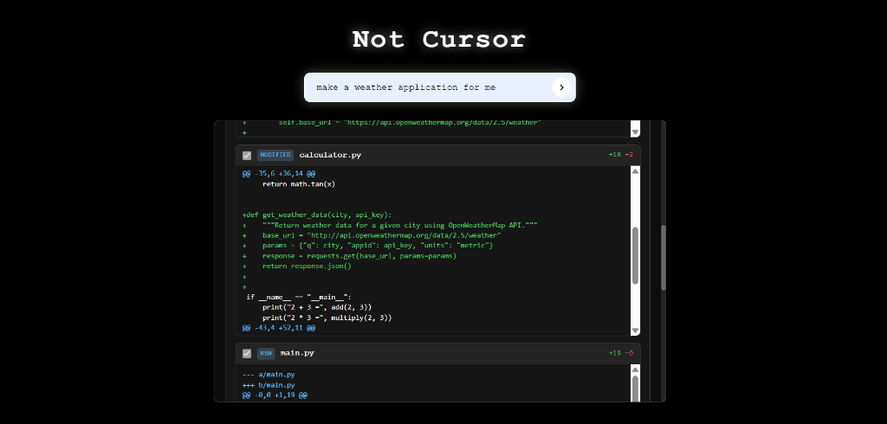
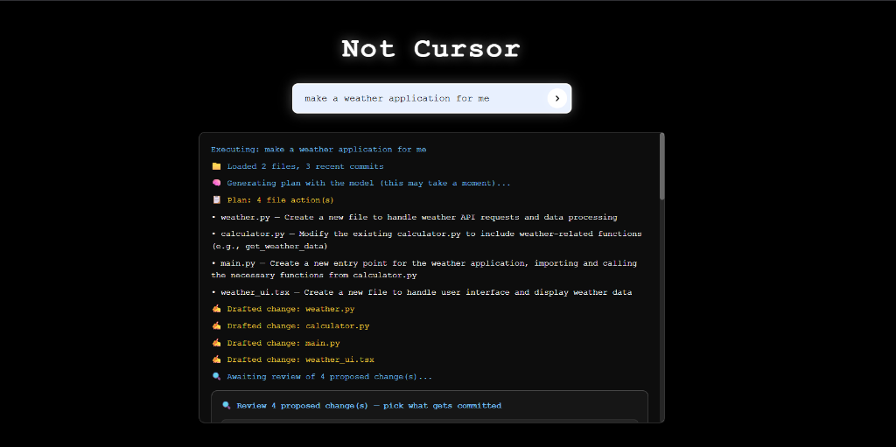

# Not Cursor — an autonomous coding agent


-000000)


> Turn a plain-English request — *"add input validation to the login form"* — into
> reviewed, multi-file Git commits. A local LLM **plans** the change, **rewrites**
> each file, and **commits** it to a fresh branch — pausing for **human approval**
> before anything touches your code, and streaming every step to the browser live.

A from-scratch take on an assistive coding agent (think Cursor / Copilot), built as a
**LangGraph state machine** that runs entirely on local infrastructure (Ollama) — **no
API keys, no per-token cost**. The interesting part isn't the prompts; it's the
engineering around them: a real graph with a conditional loop, a human-in-the-loop
`interrupt()`/resume, concurrency-safe streaming, and hard safety guards on everything
the model is allowed to touch.

---

## Engineering highlights

- **A real state machine, not a prompt-in-a-while-loop.** The workflow is a compiled
  `langgraph.StateGraph` with a typed shared state and a **conditional self-loop** that
  rewrites each planned file before converging on review/commit.
- **Human-in-the-loop by design.** The graph **pauses mid-run** at a `review` node via
  LangGraph's `interrupt()` (state persisted by a `MemorySaver` checkpointer), surfaces
  per-file diffs, and commits **only what a human approves** — then resumes with
  `Command(resume=...)`.
- **Concurrency-safe streaming.** Each job owns an isolated queue and streams progress
  over **Server-Sent Events**. This replaced an earlier design that monkeypatched
  `builtins.print` into one global queue — which broke under concurrent requests.
- **Security-conscious file I/O.** Every model-chosen path is validated against
  **path traversal** (`../../etc/passwd`) and restricted to a source-file allow-list
  before a single byte is written. Commits are **local-only** by default.
- **Resilient to messy model output.** Small local models don't reliably emit clean
  JSON, so the planner **retries with corrective re-prompts** and strips stray markdown
  code fences before parsing.
- **Config-driven, zero hardcoding.** Model, target repo, context size, and push
  behaviour all come from `.env`, so the same code runs unchanged across machines.

> ⚠️ Experimental project. By design it only **commits locally** — pushing to a remote
> is strictly opt-in (`AUTO_PUSH=true`).

## Demo

The UI is a terminal-style page that streams the agent's plan and per-file edits in real
time, then drops into a **diff-review panel** with color-coded `+/-` lines and per-file
**Approve / Reject** controls before anything is committed.





## How it works

The workflow is a compiled `langgraph.StateGraph`. Each node receives a shared `State`
(a `TypedDict`) and returns a partial update that LangGraph merges back in. The `rewrite`
node loops over itself through a **conditional edge** until every planned file is
processed, then the run **pauses at `review`** for human approval before anything is
committed:

```
START → load_context → plan → rewrite ──(more files?)──┐
                                 ▲                       │
                                 └───────────────────────┘
                                          │ (done, has changes)
                                          ▼
                                   review  ⏸  ← interrupt(): waits for human
                                          │
                                          ▼
                                       commit → END
```

| Node           | Responsibility |
|----------------|----------------|
| `load_context` | Read every tracked text file + the last *N* commit messages via GitPython |
| `plan`         | Ask the LLM for a JSON list of `{file, action}` edits and parse it (with retries) |
| `rewrite`      | For each planned file, draft new content (path-traversal–guarded) into `state["proposed"]`, leaving the baseline intact for diffing |
| `review`       | Compute unified diffs and call LangGraph's `interrupt()` — execution pauses until a human approves |
| `commit`       | Write **only the approved** files, create a branch, commit (and optionally push) |

### Concurrency-safe streaming

`/execute` creates a `job_id`, spins up a background thread, and returns immediately.
Each job owns its **own queue**, so concurrent requests never interfere. The agent gets
an `emit` callback that pushes progress messages onto that queue, and the browser
consumes them from `/stream/<job_id>` over SSE.

### Human-in-the-loop review

After drafting all edits, the agent hits the `review` node and calls LangGraph's
[`interrupt()`](https://langchain-ai.github.io/langgraph/concepts/human_in_the_loop/).
That pauses the graph mid-run (state persisted by a `MemorySaver` checkpointer) and
pushes the proposed diffs to the browser, which renders them with per-file checkboxes:

```
POST /execute             → {job_id}                  (start the run)
GET  /stream/<job_id>     → progress + a `review` SSE event with the diffs
POST /decision/<job_id>   → {"approved": ["a.py"]}    (resume with the choice)
```

The decision flows back into the graph via `Command(resume=decision)`; only approved
files are written and committed — mirroring how Cursor and Copilot gate changes behind
human review.

## Tech stack

- **Orchestration:** LangGraph (`StateGraph`, conditional edges, `interrupt()`/checkpointer)
- **LLM:** Ollama (`llama3` by default) via `langchain-ollama` — runs locally
- **Backend:** Flask, with per-job Server-Sent Events (SSE) for streaming
- **VCS:** GitPython + `git` CLI
- **Frontend:** a single dependency-free HTML/JS page

## Project layout

```
config.py          # All tunables, loaded from .env (no hardcoded values)
agent.py           # State, CodingAgent, the LangGraph graph + nodes
ui_server.py       # Flask app: /execute, /stream/<id>, /decision/<id>
templates/
  index.html       # Terminal-style UI: live SSE output + diff review panel
.env.example       # Copy to .env to configure
```

## Run it locally

**Prerequisites:** Python 3.10+, a Git repo to operate on, and
[Ollama](https://ollama.com) running with a model pulled:

```bash
ollama pull llama3
```

**Install and run:**

```bash
pip install -r requirements.txt
cp .env.example .env        # then edit as needed
python ui_server.py         # open http://localhost:5000
```

Type a prompt (e.g. *"add input validation to the login form"*) and watch the agent
plan, edit, and commit. Key `.env` settings:

| Variable           | Default | Purpose |
|--------------------|---------|---------|
| `OLLAMA_MODEL`     | `llama3`| Which local model to use |
| `TARGET_REPO_PATH` | cwd     | Absolute path to the repo to edit |
| `AUTO_PUSH`        | `false` | Push the branch to `origin` after committing |
| `GITHUB_REPO`      | —       | `owner/name`, used only to build UI links |

## Safety

- **Path traversal is blocked** — every model-supplied path is validated to stay inside
  the target repo before anything is written (`config.is_safe_path`).
- **Only source files** (`.py .js .ts .jsx .tsx`) are ever edited.
- **No automatic push** unless `AUTO_PUSH=true`. Changes land on a throwaway
  `ai-feature-*` branch, so they're always easy to discard.

## What I'd build next

The current focus was correctness, a faithful LangGraph implementation, and the
human-in-the-loop review gate. Natural next steps:

- **Structured output** via Pydantic / tool-calling instead of regex JSON parsing
- **Test-and-retry loop** — run the repo's tests after editing and feed failures back to
  the model (ReAct-style self-correction)
- **RAG over the repo** instead of stuffing every file into the prompt
- **Unit tests + Docker Compose** (app + Ollama) for one-command setup

---

Built with LangGraph, Flask, and Ollama.
